<h1 align="center"> Hi 👋, I'm </h1>

[][instagram]
[][github]
[][linkedin]

- 👯 &ensp;I’m looking to collaborate with other 
- 🗿 &ensp;Explore Code
- 📫 &ensp;How to reach me: [**Instagram**][instagram] or [**Email**][email]
## Ability Stats

  
<b> ⚙️ Tech Stack </b>

  
  
  
    
    
  </a>
  
  
  
    
       
         
<!--         -->
     
  
     
  
  
  
   

 
 
 

  
<b> ⚙️ Teols Stack </b>

  

  
 

 

[linkedin]:https://www.linkedin.com/in/nandang-eka-prasetya-265b5b1b8/
[github]: https://github.com/naneps
[instagram]: https://www.instagram.com/nannn_ep/
[facebook]:https://www.facebook.com/prasetya.libra/
[email]: ekaprasetya2244@gmail.com/
